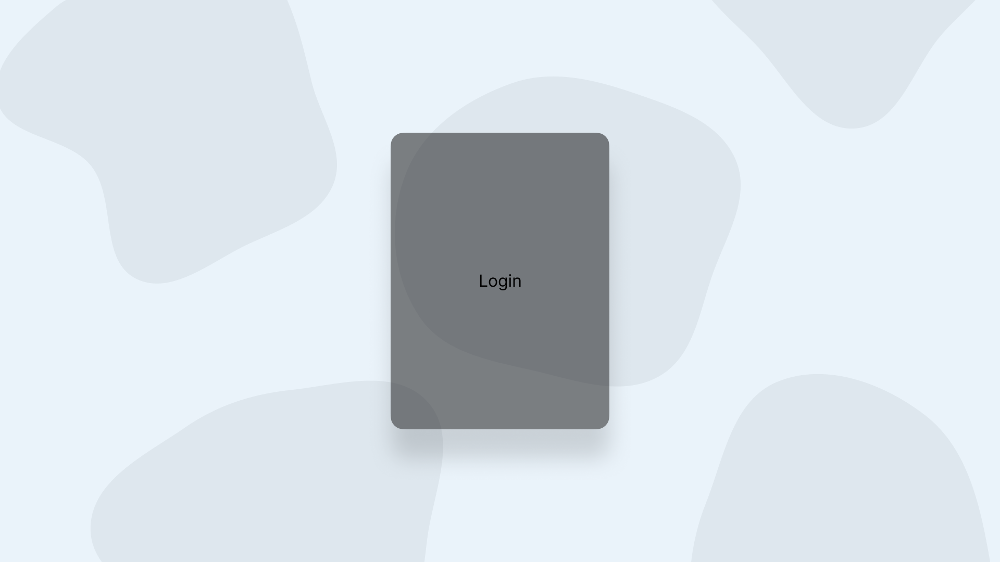
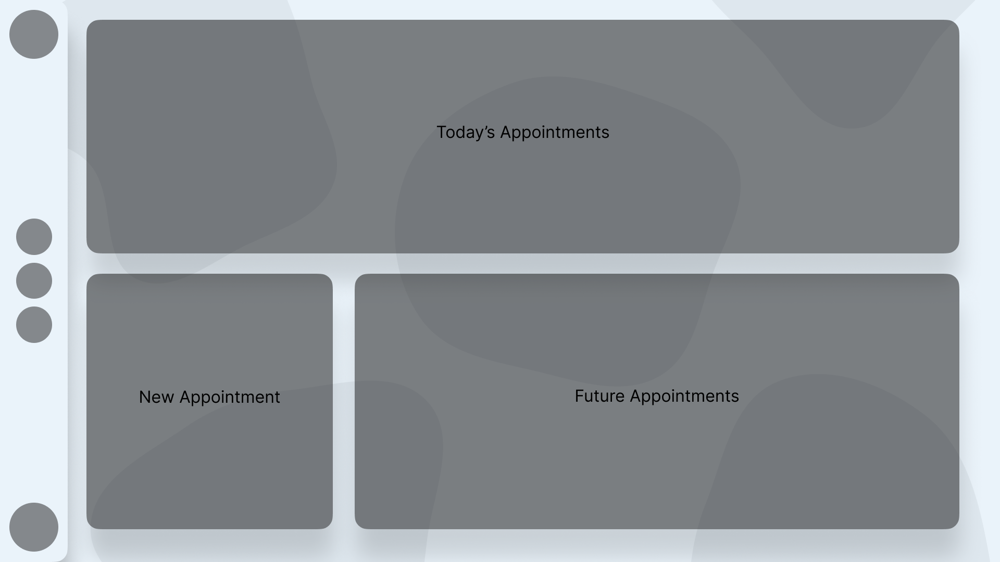
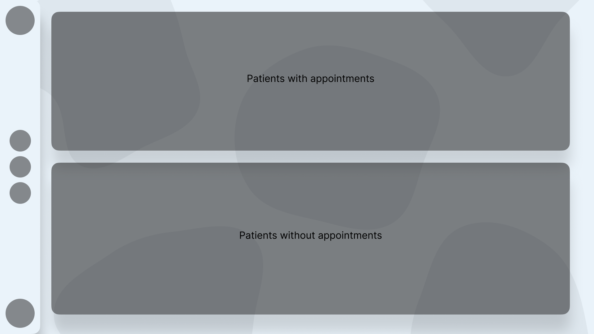
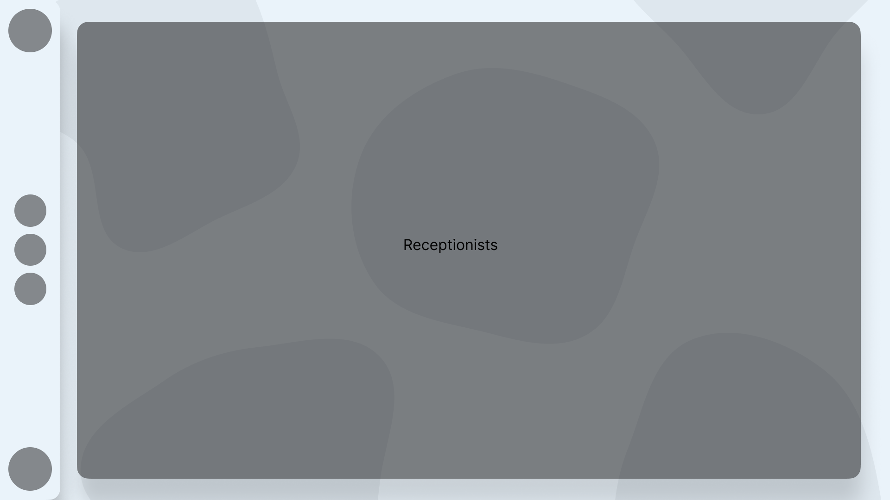

# Mareli Lourens Interactive Development 200 Term 2

## About the project:

A core feature of Web 2.0 that I find fascinating is the ability for users to upload and download content to the internet, enabling the creation of complex systems to manage large amounts of data in our day-to-day lives. This term, I was tasked with designing and developing a web management system for an anesthesiology practice, specifically catering to the needs of receptionists. The main objective of this application was to efficiently manage doctors, patients, and their appointments within the practice. To begin, I built the necessary databases and established the required relationships between them. Once the databases were in place, I delved into coding, aiming to handle significant data volumes while maintaining optimal efficiency. Additionally, I focused on creating intuitive and user-friendly visualizations that would facilitate easy exploration and management of the database through the website. This project provided a fulfilling opportunity to explore web development intricacies, database management, and user interface design, leveraging the capabilities of Web 2.0 to create a practical solution for medical practice management.
  
For this project, I utilized PHP and SQL to handle the backend functionalities, while leveraging advanced JavaScript, HTML, and CSS for the frontend development.

## Getting Started:

### Prerequisites:

* [Xampp](https://www.apachefriends.org/)

## Features and Functionality:

The web application consists of a login page and four main pages. The home page greets the logged-in receptionist and displays upcoming appointments. Additionally, the receptionist can create new appointments on this page. The patients page lists all patients, allowing receptionists to add new ones. The doctors page showcases the medical staff, enabling the head nurse to edit or remove doctor details. Lastly, the receptionists page allows the head nurse to manage the receptionist team by editing information or banning receptionists if necessary. 

## Concept Process:

### Ideation:

During the ideation phase of the project, I opted to focus on an anesthesiology practice as the target setting. Initially, my plan involved implementing both a login and signup section to enable new receptionists to join the team. For the home page, I envisioned integrating a feature where the receptionist could initiate a call to an available doctor. However, further research revealed that incorporating a complex system like Google Voice would pose significant challenges. As the project progressed, certain aspects evolved and some were eventually discarded, while the fundamental concepts remained unchanged.

### Wireframes:

## Development Process

### Highlights

Working on this project has been highly rewarding for me on a personal level. One of the major highlights was the chance to explore and learn a new programming language, PHP.

Moreover, I found the opportunity to deepen my understanding of SQL and database management to be particularly gratifying. Having struggled with SQL in the past, this project provided me with a fresh perspective and allowed me to approach it from a different angle. As a result, I was able to overcome previous challenges and gain a solid grasp of the concepts involved.

Overall, this project has been a valuable learning journey for me. It not only enabled me to enhance my skill set and gain proficiency in essential techniques but also provided a practical context for applying my knowledge to a real-world scenario. I am excited to build upon the knowledge and experiences gained from this project and continue growing as a programmer and developer in the future.

### Challenges

Throughout the duration of this project, I encountered several challenges that pushed me beyond my comfort zone and tested my skills. One of the notable hurdles I faced was related to the database implementation. Given my prior experience with SQL, I initially felt apprehensive about meeting my own development standards for this project. However, I persevered and eventually gained confidence in handling the database tasks effectively.

Another significant challenge arose when working with the form on the home page. I struggled to ensure that the webpage dynamically fetched data from the patient, doctor, and receptionist APIs when creating a new appointment. Overcoming this obstacle required thorough problem-solving and diligent experimentation.

Overall, despite the challenges encountered, this project provided me with invaluable learning experiences. It allowed me to stretch my capabilities as a developer and gain a deeper understanding of tackling complex problems. Reflecting on the project, I feel a sense of accomplishment and pride in what I have achieved. I eagerly anticipate applying the knowledge and skills acquired during this project to future endeavors and embracing new challenges along the way.

## Future Implementation

Reflecting on my work on this project, there are several areas where I feel there is room for improvement and further development. One of the key areas where I would like to focus in the future is on stabilizing the code and improving consistency. While I was able to get the code working effectively for the purposes of this project, I feel that there is room for improvement in terms of streamlining the code, making it more efficient, and reducing redundancies. In addition, I would like to develop a more consistent coding style and documentation approach, to make the code more accessible to others and easier to maintain over time.

Another area where I would like to expand and enhance the project is in making it more interactive and engaging for users. While the website is functional and provides a useful service, I believe that there is room to add more interactivity and animation to the site, in order to make it more visually appealing and engaging for users. This might involve developing new features and functionalities, such as interactive maps or dynamic data visualizations, or adding subtle animations and effects to various elements of the site.

## Final Outcome

### Mockup Video

https://user-images.githubusercontent.com/109971278/230770574-3e270853-fc89-4135-88d1-3e389ddd4074.mp4

## Conclusion
This project has been an incredible learning experience for me, and I am truly grateful for the opportunity to work on it. Throughout the course of the project, I have learned so much, from technical skills to project management and collaboration.

Working on this project has allowed me to put into practice many of the concepts and techniques I have learned in my studies, and it has also challenged me to expand my knowledge and skills. From developing the initial idea to designing and implementing the project, I have gained a deeper understanding of the software development process and the importance of effective communication and teamwork.

I am particularly proud of the progress I have made in developing my programming skills. As someone who was relatively new to coding at the start of this project, I am thrilled with the progress I have made and the many new tools and techniques I have learned along the way. I have also gained a greater appreciation for the importance of testing and debugging, and how these skills are critical to developing high-quality software.

Overall, this project has been an incredibly fulfilling experience, and I am eager to continue working on it and implementing new features and improvements in the future. I believe that this project has not only helped me to develop my technical skills, but has also given me valuable experience working in a team environment and managing a project from start to finish. I am excited to take these skills and experiences with me as I move forward in my career, and I am confident that they will serve me well in whatever challenges lie ahead.
